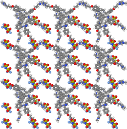
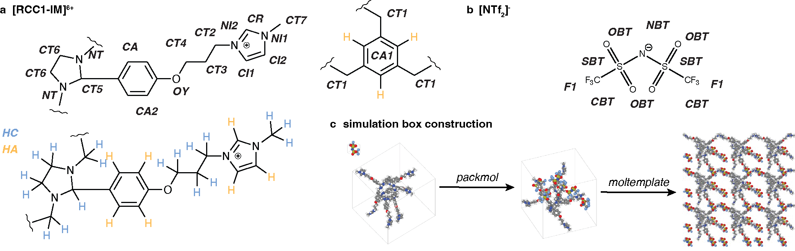
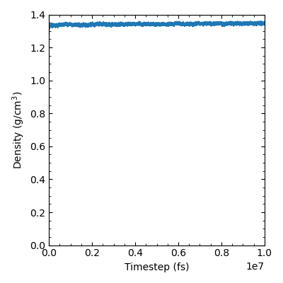
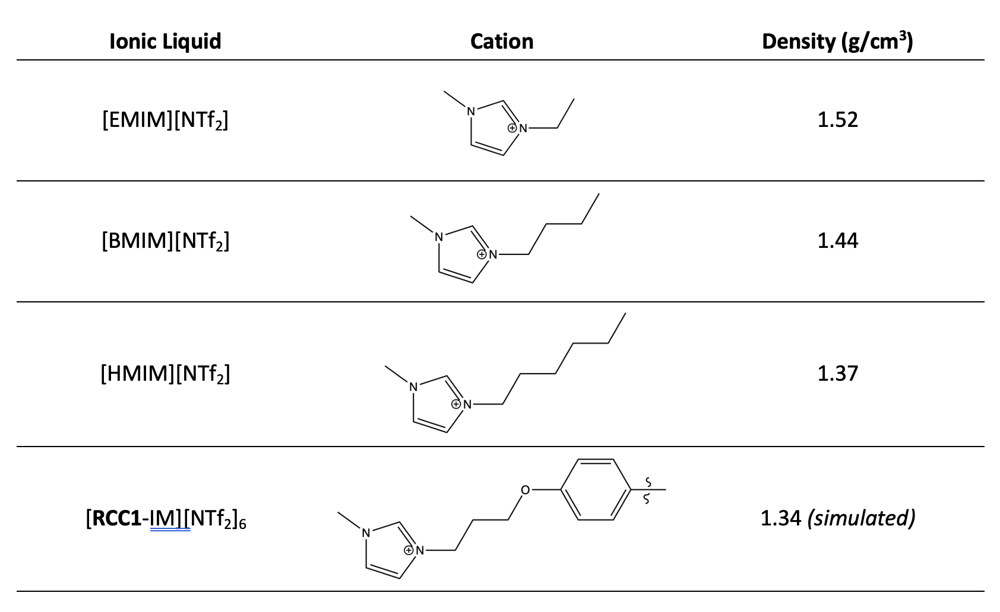

<h1 align="center">
     
    
     
    RCC1-IM-NTf2
     
</h1>

<h4 align="center">Construction of an organic cage-based porous ionic liquid using an aminal tying strategy</h4>

    <a href="#overview">overview</a> •
    <a href="#simulation">simulation setup</a> •
    <a href="#analysis">analysis</a> •
    <a href="#citation">citation</a> •

 

## overview

This repository contains the simulation details and analysis code associated
with the work presented in ["Construction of an organic cage-based porous ionic
liquid using an aminal tying strategy"]().

## simulation setup

### structure and simulation box construction

Here, we describe the structure generation and simulation box construction
workflow; the full simulation box generation procedure and MD simulation protocol
is detailed [here](https://github.com/austin-mroz/RCC1-IM-NTf2/tree/main/simulation),
as well as in the manuscript SI.
The atomistic structure of the [RCC1-IM]6+ cage was generated using the stk
software package.$^1$ Owing to the ionic nature of the cage, the system is
manually atom-typed using a combination of the IL.FF $^{2-5}$ and OPLS-AA $^6$ force 
fields, Figure 1a. The individual LAMMPS input files were generated with the
fftool package.$^7$
The atomistic structure of the [NTf2]- ion from previously reported studies is
used; this structure is described by the IL.FF forcefield,$^{2-5}$ an extension of
the OPLS-AA forcefield parameterized specifically for ionic liquids, Figure 
1b. Starting LAMMPS input files were generated with the fftool software 
package.$^7$
The simulation box is then constructed, Figure 1c. To do this, a single,
charge neutral simulation box featuring 1 cage molecule and 6 ions is generated
using the packmol software package.$^{8,9}$ Then this small simulation box is 
tiled in the x, y, and z directions using moltemplate.$^{10}$ This results in 
the final simulation box consisting of 48 cages and 288 ion molecules.

<h5 align="center">

Figure 1. (a) [RCC1-IM]6+ atom types used in simulations. Two types of H atoms
are used; HC (blue) and HA (orange). (b) [NTf2]- atom types used in 
simulations; these are from the IL.FF presented by Padua et al. 5–8 (c) 
Illustration of the simulation box construction; individual cage and ions are 
packed in a single cell at a cage:solvent ratio of 1:6 to maintain charge 
neutrality using packmol.11,12 The single cell is tiled using moltemplate13 to
generate the full simulation box.
</h5>

### system equilibration procedure

MD simulations were carried out using LAMMPS; the input files were generated 
with the moltemplate software package $^{10}$ in the final simulation box 
construction step. 

To arrive at a reasonable starting geometry, the lattice generated by 
moltemplate (Figure 1c) was slowly relaxed. A potential cutoff of 12 Å is 
used; the partial charges from the IL.FF and OPLS-AA force fields are used to 
calculate the electrostatic interactions. An NPT ensemble was used with a 
Nose-Hoover barostat and thermostat. Simulations were performed at 363 K and 1
atm. Four simulations were performed at increasing time steps: i) 50 fs 
simulation with a time step of 0.001 fs, ii) 1000 fs simulation with a timestep 
of 0.01 fs, iii) 5000 fs with a timestep of 0.1 fs, and iv) 0.9 ns with a 
timestep of 1.0 fs. The simulation box is then thermally annealed using a NVT 
ensemble. Here, a 1 fs timestep and 100 ps runs, the temperature is stepped 
from 600 K to 500 K to 400 K to 363 K. Finally, the simulation box was 
equilibrated for 50 ps using an NPT ensemble and a 1 fs timestep. A production 
run of 10 ns was then performed at 363 K and 1 atm. Figure 2 presents the 
density profile over the 10 ns production run; the density converges to 1.342 
± 0.005 g/cm $^3$.

The density profile for the 10 ns production run was plotted using [`./analysis/plot_density_equilibration_profile.py`](https://github.com/austin-mroz/RCC1-IM-NTf2/tree/main/analysis/plot_density_equilibration_profile.py)

<h5 align="center">

Figure 2. Density profile for the 10 ns production run. The density converges to 1.342 ± 0.005 g/cm $^3$.
</h5>

Experimental densities of known NTf2-based ionic liquids featuring cations containing imidazolium motifs were used, as presented by IL distributor, Ionic Liquid Technologies;14 specifically, [EMIM][NTf2], [BMIM][NTf2] and [HMIM][NTf2], Table 1. The density of [RCC1-IM][NTf2]6 equilibrated to 1.342 +/- 0.006 g/cm3. Table 1 details the cationic component of each ionic liquid, the associated density; the density reported for [RCC1-IM][NTf2]6 is calculated from the full liquid simulation. Considering the addition of the cage pores in the PIL, we expect the density to be less than known ionic liquids.

<h5 align="left">
Table 1. Experimental densities for analogous ionic liquids, [EMIM][NTf2], [BMIM][NTf2] and [HMIM][NTf2], as reported by the distributor, Ionic Liquid Technologies.[Ref. 11] The simulated density for [RCC1-IM][NTf2]6 is also reported.
</h5>
<h5 align="center">

</h5>

## simulation analysis

Simulation analysis details are presented [here](https://github.com/austin-mroz/RCC1-IM-NTf2/tree/main/analysis)

### radial distribution functions

The radial distribution function (RDF) of several atom pairs is calculated from the 10 ns trajectory, Figure S14. We examine the same atom pairs previously reported for [BMIM][NTf2] simulations.15 The similarities between the RDFs for these two systems suggests that the liquid structure of the [RCC1-IM][NTf2]6 simulation is reasonable. Further, from the cation-anion RDFs, we observe that the imidazolium rings of the [RCC1-IM]6+ cage and the imide of the [NTf2]- ion are close; this is further supported by the reported trajectory of the [NTf2]- counterions in Figure 4b of the main text.

## references

1	L. Turcani, A. Tarzia, F. T. Szczypiński and K. E. Jelfs, J. Chem. Phys., 2021, DOI: 10.1063/5.0049708.\
2	J. N. Canongia Lopes and A. A. H. Pádua, J. Phys. Chem. B, 2004, 108, 16893–16898.\
3	J. N. Canongia Lopes, J. Deschamps and A. A. H. Pádua, J. Phys. Chem. B, 2004, 108, 2038–2047.\
4	J. N. Canongia Lopes, J. Deschamps and A. A. H. Pádua, J. Phys. Chem. B, 2004, 108, 11250–11250.\
5	CL&P force field for ionic liquids https://github.com/paduagroup/clandp.git.\
6	L. S. Dodda, I. Cabeza de Vaca, J. Tirado-Rives and W. L. Jorgensen, Nucleic Acids Res., 2017, 45, W331–W336.\
7	FFTool https://github.com/paduagroup/fftool.git.\
8	L. Martínez, R. Andrade, E. G. Birgin and J. M. Martínez, J Comput Chem, 2009, 30, 2157–2164.\
9	J. M. Martínez and L. Martínez, J Comput Chem, 2003, 24, 819–825.\
10	A. I. Jewett, D. Stelter, J. Lambert, S. M. Saladi, O. M. Roscioni, M. Ricci, L. Autin, M. Maritan, S. M. Bashusqeh, T. Keyes, R. T. Dame, J.-E. Shea, G. J. Jensen and D. S. Goodsell, J. Mol. Bio., 2021, DOI: 10.1016/j.jmb.2021.166841.\
11	Ionic Liquid Technologies https://iolitec.de/en.\
12	M. H. Kowsari, M. Fakhraee, S. Alavi and B. Najafi, J. Chem. Eng. Data, 2014, 59, 2834–2849.

